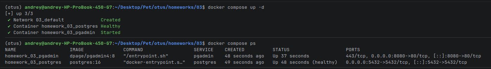
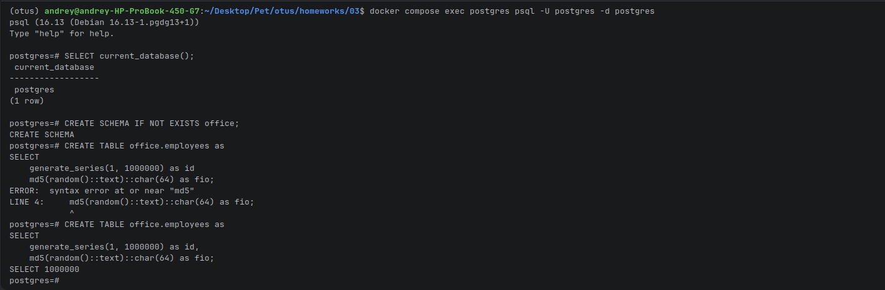
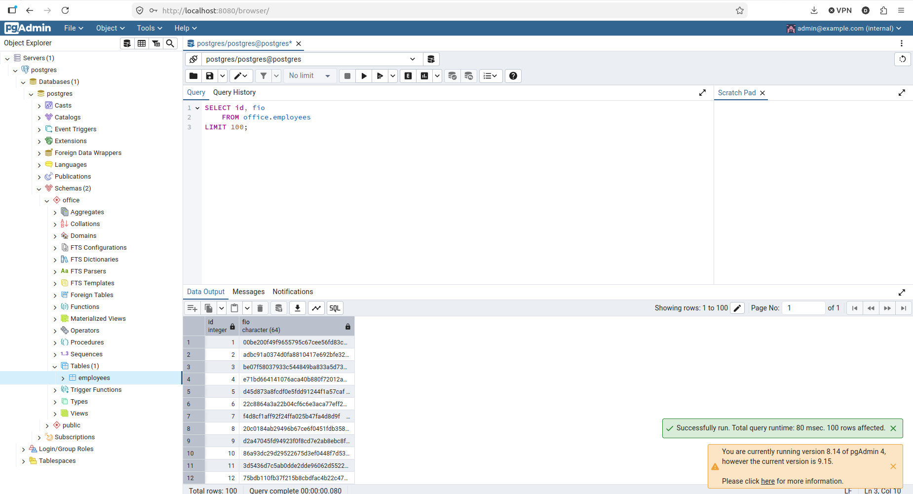

# Домашнее задание 03

## Цель

Развернуть PostgreSQL в контейнере, запустить сервер, подключиться к базе `postgres` из командной строки и через графический клиент

В качестве графического клиента используется pgAdmin, который запускается отдельным контейнером в том же `docker compose`

## Состав

- `postgres` - сервер PostgreSQL 16
- `pgadmin` - веб-интерфейс pgAdmin
- `homework_03_pgdata` - volume с данными PostgreSQL
- `homework_03_pgadmin` - volume с настройками pgAdmin

## Запуск сервера

Перейти в каталог задания:

```bash
cd /home/andrey/Desktop/Pet/otus/homeworks/03
```

Запустить контейнеры:

```bash
docker compose up -d
```

Проверить состояние:

```bash
docker compose ps
```

Ожидаемый результат:

- контейнер `homework_03_postgres` запущен
- контейнер `homework_03_pgadmin` запущен
- PostgreSQL отмечен как healthy



## Подключение через командную строку

Подключиться к базе `postgres` внутри контейнера:

```bash
docker compose exec postgres psql -U postgres -d postgres
```

Проверить текущую базу:

```sql
SELECT current_database();
```

Проверить текущего пользователя:

```sql
SELECT current_user;
```

Создать новую схему:

```sql
CREATE SCHEMA IF NOT EXISTS office;
```

Создать таблицу работников с данными:

```sql
CREATE TABLE office.employees as
SELECT
    generate_series(1, 1000000) as id,
    md5(random()::text)::char(64) as fio;
```



## Подключение через pgAdmin

Открыть pgAdmin в браузере:

```text
http://localhost:8080
```

Данные для входа:

```text
Email: admin@example.com
Password: admin
```

Параметры подключения:

```text
Host name/address: postgres
Port: 5432
Maintenance database: postgres
Username: postgres
Password: postgres
```

Внутри docker compose pgAdmin подключается к PostgreSQL по имени сервиса `postgres`, а не по `localhost`



## Остановка

Остановить контейнеры без удаления данных:

```bash
docker compose down
```

Остановить контейнеры и удалить volumes с данными:

```bash
docker compose down -v
```
